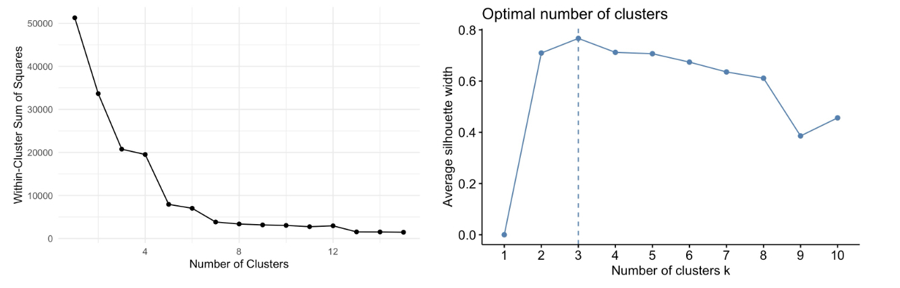
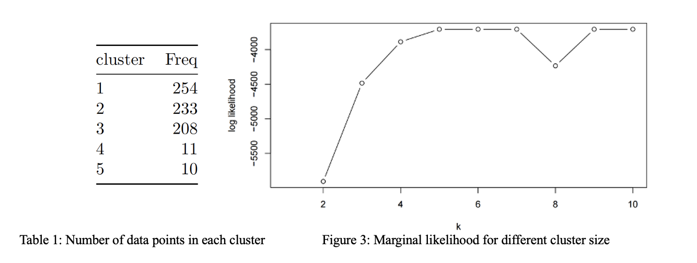
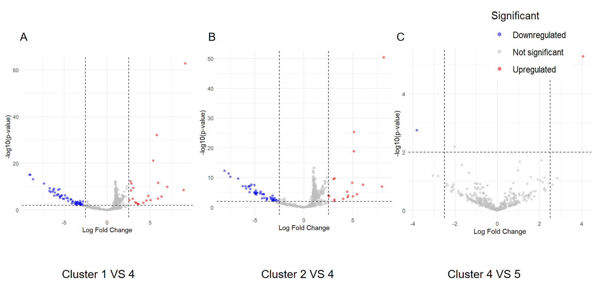

```{r, include = F}
library(ggplot2)
library(tidyverse)
library(dplyr)
library(stats) # for PCA
library(factoextra) # for PCA visualization
library(cluster) # For K-means
library(mvtnorm) # calculate multivariate normal densities

knitr::opts_chunk$set(
  fig.width = 8,
  fig.asp = .6,
  out.width = "90%"
)

theme_set(theme_minimal() + theme(legend.position = "bottom"))

options(
  ggplot2.continuous.colour = "viridis",
  ggplot2.continuous.fill = "viridis"
)

scale_colour_discrete = scale_colour_viridis_d
scale_fill_discrete = scale_fill_viridis_d

```

# Introduction

The advent of single-cell RNA sequencing (scRNA-seq)[1] has revolutionized our understanding of cellular biology by enabling gene expression analysis at the single-cell level. In this report, we delve into the analysis of scRNA-seq data from breast cancer tumors, focusing on 558 genes across 716 cells. The primary objective is to employ Principal Component Analysis (PCA) to reduce the dimensionality of our dataset, thereby simplifying the complex gene expression data while retaining the most significant variables for further analysis. By determining the optimal number of principal components, we can capture the essential variability of gene expressions, which is crucial for accurate clustering and analysis.

Following PCA[2], we utilize a Gaussian-Mixture Model (GMM)[3] and an Expectation-Maximization (EM) algorithm[4] to cluster the cells based on their gene expression profiles. This approach helps in identifying distinct cell subtypes within the breast cancer tumors, which may differ in their biological characteristics and behavior. By analyzing these clusters, we aim to uncover specific gene-expression signatures using 'limma' package in 'R'[5] that distinguish between the subpopulations, providing valuable insights into the underlying biology of breast cancer.  

This comprehensive approach to analyzing scRNA-seq data underscores the importance of advanced statistical techniques in extracting meaningful information from complex biological datasets, which is fundamental in advancing our understanding of diseases at the molecular level.


# Method

## Principal Component Analysis (PCA)

Initially, data is standardized, meaning each feature is transformed to have a mean of zero and a standard deviation of one, using the formula: $x' = \frac{x - \mu_j}{\sigma_j}$ where $\mu_j$ and $\sigma_j$ are the mean and standard deviation of feature $j$ respectively.

Subsequently, the covariance matrix is computed to represent the covariance between variables. For a matrix $X$ with $n$ observations and $d$ variables, the covariance matrix $C$ is: $C = \frac{1}{n-1} X^T X$, where $X^T$ is the transpose of $X$. Following this, eigenvalues and eigenvectors of $C$ are determined, identifying the principal components, or the directions of maximum variance. For the covariance matrix $C$, eigenvalues $\lambda$ and eigenvectors $v$ satisfy: $Cv = \lambda v$.

The principal vectors corresponding to the largest eigenvalues are selected. These are used to create a feature vector $V_k$ for dimension reduction. The original data matrix $X$ is then transformed into a new matrix $Y$ with reduced dimensions: $Y = X V_k$. Matrix $Y$ represents the projection of data onto the top $k$ principal components, effectively reducing data dimensionality while retaining significant variance and minimizing information loss.


## K-means

To detect the number of clusters, we first use K-means, the unsupervised learning method, to obtain an approximate range of number of clusters. Based on the two plots below, cluster sizes ranging from $2, 3, \cdots, 10$ is taken into consideration.

```{r, echo = FALSE}

```

Figure 1 and 2: Comparisons of different cluster sizes

## Guassian Mixture Model

After determining the number of components using PCA, the Gaussian Mixture Model (GMM) is introduced as a way of clustering. The main assumption of GMM is that there are a certain number of Gaussian distributions. Furthermore, each of these Gaussian distributions represent a specific cluster. Suppose we have $k$ clusters. Let $X_i$ denote each individual cell, then we have $X\sim N(\mu_j,\Sigma_j)$ with probability $p_j,\,j=1,2,\cdots,k.$ The density of $X$ is thus
$$f(\mathbf x; \boldsymbol \mu, \Sigma) = \frac{\text{exp} (-\frac{1}{2}(\boldsymbol x - \boldsymbol \mu)^T\Sigma^{-1}(\boldsymbol x - \boldsymbol \mu))}{\sqrt{{(2\pi)^p|\Sigma|}}} $$
where $\boldsymbol \mu$ is $p$-dimensional mean, and $\Sigma$ is $p\times p$ variance-covariance matrix;

Through multiplying density of $X_i$ and possibility for each $X_i$ and summing up the product for each cluster, an observed likelihood of $(x_1,...,x_n)$ can be calculated as below: 
$$L(\theta; \mathbf x_1,\mathbf x_2,...,\mathbf x_n) = \prod_{i=1}^n \sum_{j = 1}^k p_j f(\mathbf x_i; \boldsymbol \mu_j, \Sigma_j)$$
In order to distinguish which data point belongs to which cluster, a latent variable $\gamma_i$ is used as the cluster indicator that indicates the probability that each data point belongs to each cluster of the GMM. Hence, let $\mathbf \gamma_i = (\gamma_{i,1},...,\gamma_{i,k})\in \mathbb R^k$  as the cluster indicator of $\mathbf x_i$, which  takes form $(0, 0,...,0,1,0,0)$ with $\gamma_{i,j} =I\{ \mathbf x_i\mbox{ belongs to  cluster } j\}$. The distribution of $\mathbf \gamma_i$ is $f(\mathbf \gamma_i) = \prod_{j= 1}^k p_j^{\gamma_i,j}$.

Through multiplying the distribution of $\gamma_i$ with the conditional distribution of $\mathbf x_i$  given $\mathbf \gamma_i$, which is 
$f(\mathbf x_i|\mathbf \gamma_i) =  \prod_{j= 1}^k f(\mathbf x_i; \boldsymbol \mu_j, \Sigma_j)^{\gamma_i,j}$, the complete likelihood function can be calculated as below using the conditional distribution formula: $L(\theta; \mathbf x,\mathbf \gamma) = \prod_{i=1}^n \prod_{j=1}^k [p_j f(\mathbf x_i; \boldsymbol \mu_j, \Sigma_j)] ^{\gamma_{i,j}}$. Furthermore, the complete log-likelihood becomes:

$$\ell(\theta; \mathbf x,\mathbf \gamma) = \sum_{i=1}^n \sum_{j=1}^k \gamma_{i,j} [\log p_i + \log  f(\mathbf x_i; \boldsymbol \mu_j, \Sigma_j)] = \sum_{i=1}^n \sum_{j=1}^k \gamma_{i,j} [\log p_i-1/2\log|\Sigma|-1/2 (\mathbf x_i-\boldsymbol \mu_j)^\top\Sigma (\mathbf x_i-\boldsymbol \mu_j)]$$

## Expectation-Maximization Algorithm: 

**E-step**

Following, the GMM model is integrated into the Expectation-Maximization algorithm. In the Expectation step, an initial guess of parameters in the GMM model is taken using a pre-determined cluster size (k) value, including the means $\mu_k$, co-variances $\Sigma_k$, and mixing coefficients $p_k$. Using these initial parameters of the GMM model, the responsibilities can be evaluated as following: 

$$\gamma_{i, k} ^{(t)}=   
\frac{p_k^{(t)}f(\mathbf x_i|\boldsymbol \mu_k^{(t)}, \Sigma_k^{(t)})}
{\sum_{j=1}^K p_j^{(t)}f(\mathbf x_i|\boldsymbol \mu_j^{(t)}, \Sigma_j^{(t)})}$$
where $t$ denote the $t_{th}$ iteration; In the numerator of this function, the mixing coefficient $p_k$ is multiplied by the possibility density function of $X_i$ under component k. This multiplication results in the prior probability of data point $x_i$ belonging to component k.

The denominator of this function is the sum of the prior probabilities across all components j (where $j = 1, 2, \cdots,k$). This normalization step ensure that the responsibilities sum up to 1 for each data point. 

**M-step** 

Next, in the Maximization step, the parameters of the GMM (means, co-variances, and mixing coefficients) based on the computed responsibilities for each cluster that was obtained from the Expectation step. 

First, let $n_k = \sum_{i=1}^n \gamma_{i, k}$. The updated mixing coefficient $p_k$ for component k is calculated as the average responsibility assigned to that component: $p_k^{(t+1)} = \frac{n_k}{n}$. The mean $\mu_k$ of each component is updated using a weighted average of data points, where the weights are the responsibilities $\gamma_i$ assigned to each data point for component k: $\boldsymbol \mu_k^{(t+1)} = \frac{1}{n_k} \sum_{i=1}^n \gamma_{i, k} \mathbf x_i$. Using the updated components means, the co-variance matrix $\Sigma_k$ of each component is updated based on the responsibility-weighted sum of squared distances between the data points and the component means:

$$\Sigma_k^{(t+1)} = \frac{1}{n_k} \sum_{i=1}^n \gamma_{i, k} (\mathbf x_i - \boldsymbol \mu_k^{(t+1)})(\mathbf x_i - \boldsymbol \mu_k^{(t+1)})^T$$

In each iteration t, the E-M algorithm is repeated to update theses parameters until an optimization of likelihood function is achieved. After an optimization is achieved, the assignment of each data point to a specific cluster is done based on the largest value of latent variable for each cell. If two clusters have the same parameters, the data point would be randomly assigned to one cluster.


## Gene-expression signatures


### Data Normalization and Precision Weights Estimation

Using the `voom` package, expression data is transformed to $log_2$ scale, adding 0.5 to address zero counts, and subsequently normalized. This transformation facilitates comparability across different expression levels. Precision weights for each gene are estimated through a linear model, which assesses expression differences across clusters. The `LOWESS` method is applied to predict variance from the square root of residual standard deviations and average log-counts. The inverse of this estimated variance ($\frac{1}{variance}$) serves as a precision weight, correcting for heteroscedasticity and enabling weighted least squares fitting in the subsequent analysis.

### Linear Model Fitting and Updating Coefficients

Post-normalization, the `lmFit` function fits linear models row-wise to the expression matrix, using variance-based weights. A design matrix designates cluster memberships per sample, allowing the evaluation of gene expression in relation to cluster variables. To perform specific pairwise cluster comparisons, a contrast matrix is established and integrated into each gene's model through the `contrasts.fit` function, facilitating the calculation of fold changes, F-statistics, and p-values.

### Enhancing Statistical Testing

To bolster the robustness of statistical outcomes, Empirical Bayes (EB) methods adjust linear model coefficients by calculating a prior variance distribution based on the variance across all genes and a weighted average. This distribution assists in estimating a posterior variance by amalgamating the prior with individual gene variances, reducing uncertainties in statistical assessments based on small-sample variances.

### Identification of DEGs

DEGs are determined by examining fold changes in gene expression (log scale), F-statistics, and p-values. Genes showing significant up-regulation (log FC > 2.5) or down-regulation (log FC < -2.5) with a p-value < 0.01 are classified accordingly. Furthermore, for each cluster, genes are identified as DEGs if they exhibit significant differential expression in at least two contrasts involving the cluster, with $|log FC| > 2$ and p-value < 0.01. The `limma` package orchestrates all steps in this analysis, ensuring a streamlined and efficient identification of gene-expression signatures.


# Results

## Principal Component Analysis (PCA)

The PCA was successfully applied to reduce the dimensions of our data set consisting of 558 genes across 716 cells. The scree plot, used to determine the number of principal components to retain, indicated that the first three components accounted for a significant portion of the variance in the data. These components collectively captured over 60% of the total variance, suggesting that they are significant in representing the data set's complexity.

## Guassian Mixture Model and Expectation-Maximization Algorithm: 

Through implementing the E-M algorithm is implemented in R (Appendix: E-M Algorithm), updated parameters, including $\mu_k$, $\Sigma_k$, and $p_k$, are obtained for each cluster. The marginal likelihood can be then calculated using the GMM function. 

Through comparing the marginal likelihood for cluster sizes ranging from $2, 3, \cdots, 10$ using iteration (Figure 3), a cluster size of 5 is selected for the final GMM model. 

```{r, echo = FALSE}

```

Using the cluster size 5, which data point belongs to each of the 5 clusters could be determined (Table 1).


## Gene-expression signatures

After conducting the differential gene expression analysis, 69 DEGs were identified in cluster 1 (19 up regulated, 50 down regulated), 69 DEGs in cluster 2 (17 up regulated, 52 down regulated), 1 DEGs in cluster 3 (1 up regulated, 0 down regulated), 6 DEGs in cluster 4 (6 up regulated, 0 down regulated), and 5 DEGs in cluster 5 (4 up regulated, 1 down regulated). 

Fig.4(see Supplementary) displays the significantly differentially expressed genes in several unique pairwise comparisons between each cluster, with red indicating up regulated genes and blue indicating down regulated genes. Additionally, Table 2(see Supplementary) lists top 1 specific genes (with largest |FC|)that are uniquely expressed within a cluster after integrating all comparisons involving that cluster (the complete list of DEGs is provided in Supplementary Tables). These uniquely differentially expressed genes within a cluster can be used to distinguish between different clusters based on changes in their expression levels.


# Conclusion

In this project, the PCA effectively reduced the data set's dimensionality, allowing the identification of principal components that capture the major variance within the gene expressions. Three components served as a robust foundation for the subsequent clustering analysis. The use of the GMM to cluster the cells based on their gene expression profiles was pivotal in revealing 5 distinct clusters within the tumor cells. This stratification highlighted the variability in gene expression even among cells that are phenotypically similar, underscoring the complexity of tumor biology.

Moreover, the study identified 381 significantly differentially expressed genes (DEGs) among these clusters, with 185 genes upregulated and 195 downregulated. This detailed gene expression profiling not only enhances our understanding of the molecular underpinnings of breast cancer but also suggests potential targets for therapeutic intervention. Each cluster's unique gene expression signature provides insights into their biological functions and roles in cancer progression.

There still some areas of this project are expected to be explored in the future study. During the iteration of EM, poor selection may result in NA values and some clusters do not contain any elements. Although genes that are important for differentiating the clusters were identified, as the `limma` package prefers raw count data, the accuracy of the differential expression analysis might be affected due to the original expression data not being raw counts from single-cell sequencing and the normalization process not being explicitly defined. Additionally, while the analysis still relies on linear models to estimate the fold changes of each gene across different clusters, to enhance the accuracy of the results, some nonlinear methods could be applied in the future.

\newpage

# Contribution

Zhuodiao Kuang: Initialized the work; Applied PCA to find components for the further study; Explored gene expression using ANOVA tests; Organized the report. Shaolei Ma: Lead the team; Designed EM algorithm to estimate the GMM model; Connected the work between teammates; Peng Su: Solved the problem of identifying gene-expression signatures with state-of-the-art methods; Found DEGs in clusters; Yilei Yang: Utilized K-means to detect the number of clusters and introduced the Gaussian Mixture Model; Launched the meetings for teammates.


# Reference

[1]Levsky, Jeffrey M., et al. "Single-cell gene expression profiling." Science 297.5582 (2002): 836-840.

[2]Abdi, H., & Williams, L. J. (2010). Principal component analysis. Wiley interdisciplinary reviews: computational statistics, 2(4), 433-459.

[3]Reynolds, D. A. (2009). Gaussian mixture models. Encyclopedia of biometrics, 741(659-663).

[4]McLachlan, G. J., & Krishnan, T. (2007). The EM algorithm and extensions. John Wiley & Sons.

[5]Smyth, G. K. (2005). Limma: linear models for microarray data. In Bioinformatics and computational biology solutions using R and Bioconductor (pp. 397-420). New York, NY: Springer New York.


# Supplementary

```{r echo=FALSE}

```

Figure 4: The Volcano plot for unique cluster comparisons. (A) Cluster 1 VS 4, (B) Cluster 2 VS 4, (C) Cluster 4 VS 5.

```{r echo=FALSE}
up1 = read.csv("up1.txt", header = FALSE)$V1
down1 = read.csv("down1.txt", header = FALSE)$V1

up2 = read.csv("up2.txt", header = FALSE)$V1
down2 = read.csv("down2.txt", header = FALSE)$V1

up3 = read.csv("up3.txt", header = FALSE)$V1
down3 = read.csv("down3.txt", header = FALSE)$V1

up4 = read.csv("up4.txt", header = FALSE)$V1
down4 = read.csv("down4.txt", header = FALSE)$V1

up5 = read.csv("up5.txt", header = FALSE)$V1
down5 = read.csv("down5.txt", header = FALSE)$V1

up12 = up1[which(! up1 %in% c(up2, up3, up4, up5))][1]
up42 = up4[which(! up4 %in% c(up1, up2, up3, up5))][1]
up52 = up5[which(! up5 %in% c(up1, up2, up3, up4))][1]

down12 = down1[which(! down1 %in% c(down2, down5, down3, down4))][1]

top1 = data.frame(up1 = up12, up4= up42, up5 = up52, down1 = down12)

```


$$Table 2: Top 1 DEGs with largest log FC (absolute value) in clusters$$

```{r echo=FALSE}
knitr::kable(top1, col.names = c("cluster1 up", "cluster4 up","cluster5 up", "cluster1 down"))
```

```{r echo=FALSE, message=FALSE, warning=FALSE}
knitr::kable(up1, col.names = "up1")
knitr::kable(down1, col.names = "down1")

knitr::kable(up2, col.names = "up2")
knitr::kable(down2, col.names = "down2")

knitr::kable(up3, col.names = "up3")

knitr::kable(up4, col.names = "up4")

knitr::kable(up5, col.names = "up5")
knitr::kable(down5, col.names = "down5")
```
