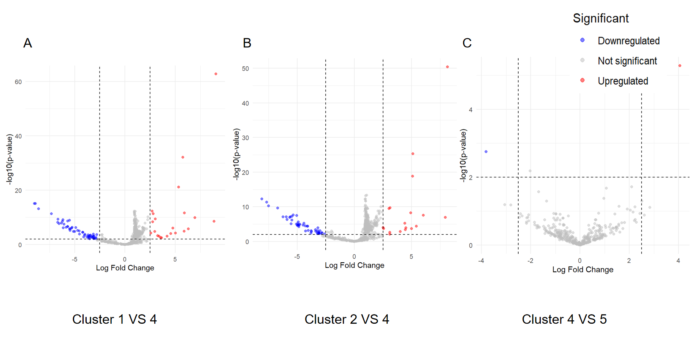

---
title: "DEG_report"
author: "Peng Su"
date: "2024-04-26"
output: pdf_document
---

# Method

## Gene-expression signatures

After clustering cells using a Gaussian-Mixture Model (GMM), Differential Gene Expression (DEG) analysis was performed to identify genes that differentiate the clusters. The analysis involved data normalization, precision weights estimation, linear model fitting, and updates in variance and statistics, using an expression matrix of 557 genes (rows) across 716 cells (columns) with cluster data for each cell.

### Data normalization and precision weights estimation

The `voom` package is used to transform and normalize the sparse expression data for comparability. It converts expression levels to $log_2$ scale (adding 0.5 for zeros) and normalizes the transformed matrix. Then it fits a linear model to assess expression differences between clusters. Using the `LOWESS` method, it predicts variance from the relationship between the square root of residual standard deviations and average log-counts. This estimated variance's inverse ($\frac{1}{variance}$) serves as a precision weight to correct heteroscedasticity, enabling weighted least squares fitting in the linear model analysis.

### Linear model fitting and coefficient updating

After data processing, the `lmFit` function is applied to fit linear models row-wise to the expression matrix, which incorporates variance-based weights for each gene. The design matrix indicates clusters for each sample. These models evaluates gene expression relationships with cluster variables. After this evaluation, a contrast matrix is defined for specific pairwise cluster comparisons. The `contrasts.fit` function integrates these comparisons into each gene's model, facilitating statistical tests that yield fold changes, F-statistics, and p-values between groups.

### Improvements in statistical testing

To increase the robustness and stability of statistical analysis, Empirical Bayes (EB) is utilized to refine the inference of linear model coefficients (fold changes). EB calculates a prior variance distribution from the variance across all genes and a weighted average. This prior variance is then combined with each gene's individual sample variance to estimate a posterior variance, effectively reducing uncertainty in statistical tests reliant on small-sample variances. This approach adjusts the reliance on prior variance when individual gene variances are based on limited data. 

### Finding DEGs

Finally, based on the fold changes (FC) in gene expression between groups (log scale), F-statistics, and p-values, the DEGs among all cluster contrast are defined as:

* Significantly up-regulated gene (increase of expression): $log FC > 2.5$, with $p.value < 0.01$.

* Significantly down-regulated gene (increase of expression): $log FC < -2.5$, with $p.value < 0.01$.

Then for each cluster, genes that are significantly differentially expressed in at least 2 of the contrasts which one cluster involved are defined as DEGs in that cluster, with $|log FC| > 2$ and $p.value < 0.01$.

All the steps and functions that involved in this Gene-expression signatures analysis is conducted by `limma` package.

# Results

After conducting the differential gene expression analysis, 69 DEGs were identified in cluster 1 (19 up regulated, 50 down regulated), 69 DEGs in cluster 2 (17 up regulated, 52 down regulated), 1 DEGs in cluster 3 (1 up regulated, 0 down regulated), 6 DEGs in cluster 4 (6 up regulated, 0 down regulated), and 5 DEGs in cluster 5 (4 up regulated, 1 down regulated). 

Fig.1 displays the significantly differentially expressed genes in several unique pairwise comparisons between each cluster, with red indicating up regulated genes and blue indicating down regulated genes. Additionally, Table 1 lists top 1 specific genes (with largest |FC|)that are uniquely expressed within a cluster after integrating all comparisons involving that cluster (the complete list of DEGs is provided in Supplementary Tables). These uniquely differentially expressed genes within a cluster can be used to distinguish between different clusters based on changes in their expression levels.

```{r echo=FALSE, fig.cap="The Volcano plot for unique cluster comparisons. (A) Cluster 1 VS 4, (B) Cluster 2 VS 4, (C) Cluster 4 VS 5", out.width='100%'}

```

```{r echo=FALSE}
up1 = read.csv("up1.txt", header = FALSE)$V1
down1 = read.csv("down1.txt", header = FALSE)$V1

up2 = read.csv("up2.txt", header = FALSE)$V1
down2 = read.csv("down2.txt", header = FALSE)$V1

up3 = read.csv("up3.txt", header = FALSE)$V1
down3 = read.csv("down3.txt", header = FALSE)$V1

up4 = read.csv("up4.txt", header = FALSE)$V1
down4 = read.csv("down4.txt", header = FALSE)$V1

up5 = read.csv("up5.txt", header = FALSE)$V1
down5 = read.csv("down5.txt", header = FALSE)$V1

up12 = up1[which(! up1 %in% c(up2, up3, up4, up5))][1]
up42 = up4[which(! up4 %in% c(up1, up2, up3, up5))][1]
up52 = up5[which(! up5 %in% c(up1, up2, up3, up4))][1]

down12 = down1[which(! down1 %in% c(down2, down5, down3, down4))][1]

top1 = data.frame(up1 = up12, up4= up42, up5 = up52, down1 = down12)

knitr::kable(top1, caption = "Top 1 DEGs with largest log FC (absolute value) in clusters", col.names = c("cluster1 up", "cluster4 up","cluster5 up", "cluster1 down"))
```


# Disscusion

Although genes that are important for differentiating the clusters were identified, as the `limma` package prefers raw count data, the accuracy of the differential expression analysis might be affected due to the original expression data not being raw counts from single-cell sequencing and the normalization process not being explicitly defined. Additionally, while the analysis still relies on linear models to estimate the fold changes of each gene across different clusters, to enhance the accuracy of the results, some nonlinear methods could be applied in the future.

# Supplementary

```{r echo=FALSE, message=FALSE, warning=FALSE}
knitr::kable(up1, col.names = "up1")
knitr::kable(down1, col.names = "down1")

knitr::kable(up2, col.names = "up2")
knitr::kable(down2, col.names = "down2")

knitr::kable(up3, col.names = "up3")

knitr::kable(up4, col.names = "up4")

knitr::kable(up5, col.names = "up5")
knitr::kable(down5, col.names = "down5")
```

